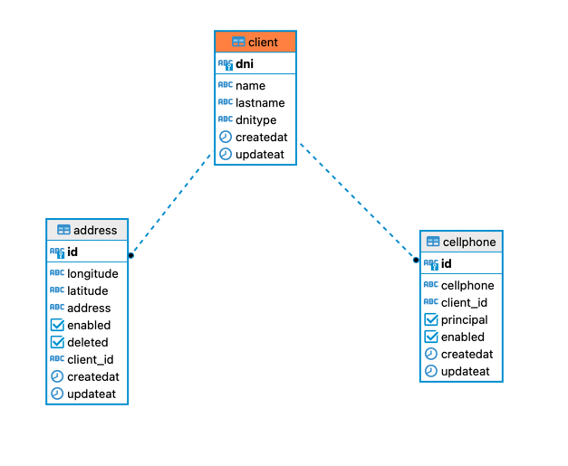

# User-Kotlin

***Esto no son ejercicios academicos, son proyectos que me voy inventando y creo que pueden servir a otras personas para aprender***

## Objetivo
Realizar un microservicio que se conecte a una base de datos relacion PostgresSQL y sea capaz de realizar CRUD sobre esta base de datos.

Se utilizara el siguiente modelo para la base de datos del microservicio.

## Condiciones

Para los tipos de documento se debe de tener presente que en Colombia son validos

### Documentos
* C.C. Cédula de ciudadanía
* C.E. Cédula de extranjería
* P.P: Pasaporte
* T.I. Tarjeta de identidad
* NIT: Número de identificación tributaria (No aplica)

### Celular
El celular debe seguir el formato colombiano, iniciar por 3 y una longitud de 10 caracteres.

### Direcciones

Por el momento longitud y latitude deben quedar nulos

### Docker

Se debe de dockerizar postgres y dejar configurado para poder ejecutarlo en otra maquina, la base de datos.

### Flyway

Se debe configurar Flyway para manejar las versiones de SQL.

## Tecnologias
* Kotlin
* Spring
* Docker
* PostgresSQL
* Flyway
